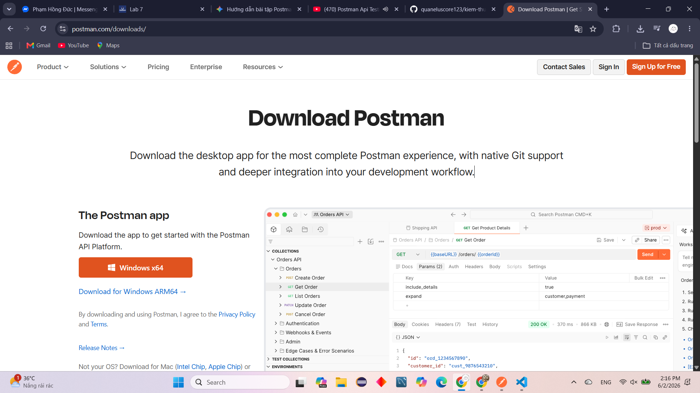
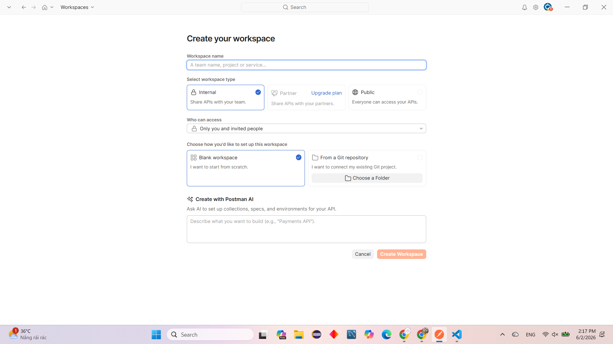
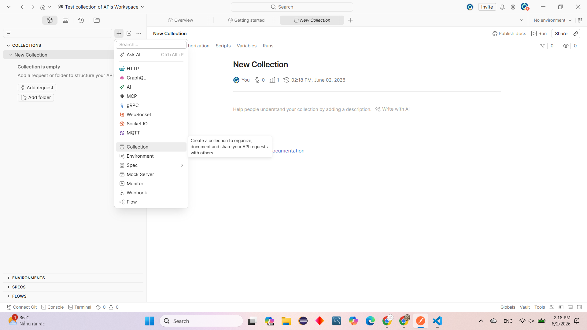
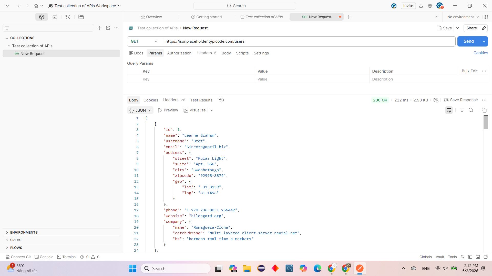

# Báo cáo thực hành: Kiểm thử API cơ bản với Postman

## 1. Thông tin chung
- **Họ và tên:** Hoàng Minh Quân
- **Mã sinh viên:** [Điền mã sinh viên của bạn vào đây]
- **Mục đích:** Thực hành cài đặt, làm quen với giao diện Postman và các thao tác thiết lập môi trường kiểm thử ban đầu.

## 2. Kết quả thực hành

### 2.1. Cài đặt công cụ Postman
- Tiến hành tải bộ cài đặt Postman bản Windows x64 từ trang chủ chính thức.

### 2.2. Khởi tạo Workspace
- Tạo một Workspace mới với chế độ "Blank workspace" để có không gian lưu trữ và quản lý các dự án kiểm thử riêng biệt.

### 2.3. Tạo Collection mới
- Trong `Test collection of APIs Workspace`, tiến hành tạo một **New Collection** để chuẩn bị nhóm các API Request lại với nhau cho gọn gàng và dễ chạy tự động sau này.

### 2.4. Thực hiện gọi API (GET Request)
- Tiến hành gửi request đến đường dẫn thay thế: `https://jsonplaceholder.typicode.com/users`
- Hệ thống trả về dữ liệu danh sách người dùng dưới dạng JSON thành công với mã trạng thái `200 OK`.

